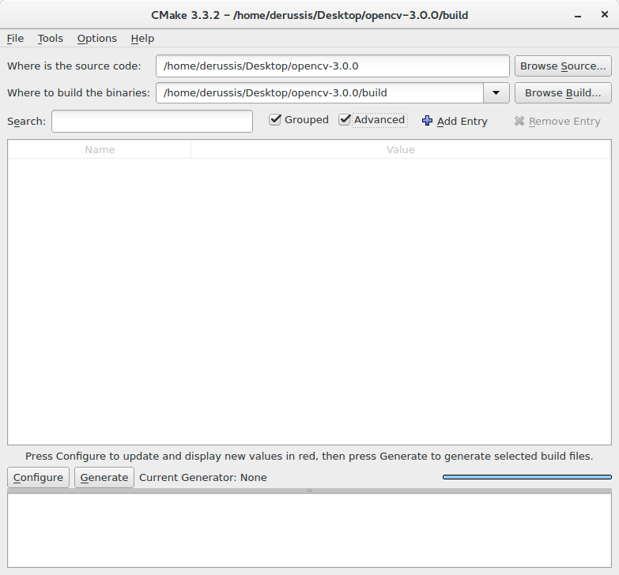

==========================
Installing OpenCV for Java
==========================

Introduction to OpenCV for Java.
--------------------------------
As of OpenCV 2.4.4, OpenCV supports desktop Java development. This tutorial will help you install OpenCV on your desktop operating system.

Install the latest Java version.
--------------------------------
Download the latest Java JDK at the `Oracle link <http://www.oracle.com/technetwork/java/javase/downloads/index.html>`_. Now you should be able to install the last Java JDK by open the file just downloaded.

Install the latest Eclipse version.
-----------------------------------
Download the latest Eclipse version at the `Eclipse Download page <https://www.eclipse.org/downloads/>`_ choosing the ``Eclipse IDE for Java Developers`` version (suggested).
Extract the downloaded compressed file and put the resulting folder wherever you want to. You don't need to install anything. Alternatively, you can try the Eclipse installer.

Install OpenCV 3.0 under Windows.
------------------------------------
First of all you should download the OpenCV library (version 3.0) from `here <http://opencv.org/downloads.html>`_.
Then, extract the downloaded OpenCV file in a location of your choice. Once you get the folder ``opencv`` put in wherever you prefer.
Now the only two things that you will need are: the ``opencv-300.jar`` file located at ``\opencv\build\java`` and the ``opencv_java300.dll`` library located at ``\opencv\build\java\x64`` (for 64-bit systems) or ``\opencv\build\java\x86`` (for 32-bit systems).

Install OpenCV 3.0 under Linux or Mac.
-----------------------------------------
Please, note: the following instructions are also useful if you want to compile OpenCV under Windows.
As first step, download and install `CMake <http://www.cmake.org/download/>`_ and `Apache Ant <http://ant.apache.org/>`_, if you don't have any of these. Download the OpenCV library from the `its website <http://opencv.org/downloads.html>`_.
Extract the downloaded OpenCV file in a location of your choice and open CMake ( cmake-gui ).
Put the location of the extracted OpenCV library in the ``Where is the source code field`` (e.g., /opencv/) and insert the destination directory of your build in the ``Where to build the binaries`` field (e.g., /opencv/build).
At last, check the ``Grouped`` and ``Advanced`` checkboxes.



Now press ``Configure`` and use the default compilers for ``Unix Makefiles``. Please, be sure to have installed a C/C++ compiler.
In the ``Ungrouped Entries`` group, insert the path to the Apache Ant executable (e.g., ``/apache-ant-1.9.6/bin/ant``).
In the ``BUILD`` group, unselect:
* ``BUILD_PERF_TESTS``.
* ``BUILD_SHARED_LIBRARY`` to make the Java bindings dynamic library all-sufficient.
* ``BUILD_TESTS``.
* ``BUILD_opencv_python``.

In the ``CMAKE`` group, set to ``Debug`` (or ``Release``) the ``CMAKE_BUILD_TYPE``
In the ``JAVA`` group:
insert the Java AWT include path (e.g., ```/usr/lib/jvm/java-1.8.0/include/``)
insert the Java AWT library path (e.g., ``/usr/lib/jvm/java-1.8.0/include/jawt.h``)
insert the Java include path (e.g., ``/usr/lib/jvm/java-1.8.0/include/``)
insert the alternative Java include path (e.g., ``/usr/lib/jvm/java-1.8.0/include/linux``)
insert the JVM  library path (e.g., ``/usr/lib/jvm/java-1.8.0/include/jni.h``)

Press ``Configure`` twice, and the CMake window should appear with a white background. Now, press ``Generate`` and close CMake.

.. image:: _static/01 - 01.png

Now open the terminal, go to the ``build`` folder of OpenCV and compile everything with the command: ``make -j``. Notice that the `-j` flag tells `make` to run in parallel with the maximum number of allowed job threads, which makes the build theoretically faster.
Wait for the process to be completed...
If everything went well you should have ``opencv-300.jar`` in the ``/opencv/build/bin`` directory and ``libopencv_java300.so`` in the ``/opencv/build/lib`` directory. This is everything you need.

Set up OpenCV for Java in Eclipse
---------------------------------
Open Eclipse and select a workspace of your choice. Create a User Library, ready to be used on all your next projects: go to  ``Window > Preferences...``.

.. image:: _static/01 - 02.png

From the menu navigate under ``Java > Build Path > User Libraries`` and choose ``New...``.
Enter a name for the library (e.g., opencv) and select the newly created user library.
Choose ``Add External JARs...``, browse to select ``opencv-300.jar`` from your computer.
After adding the jar, extend it, select ``Native library location`` and press ``Edit...``.

.. image:: _static/01 - 03.png

Select ``External Folder...`` and browse to select the folder containing the OpenCV libraries (e.g., ``C:\opencv\build\java\x64`` under Windows).
