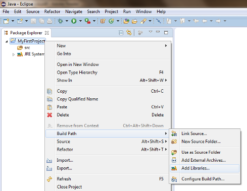

=======================================
Your First Java Application with OpenCV
=======================================

.. note:: We assume that by now you have already read the previous tutorials. If not, please check previous tutorials at `<http://opencv-java-tutorials.readthedocs.org/en/latest/index.html>`_. You can also find the source code and resources at `<https://github.com/opencv-java/>`_

A Java application with OpenCV
------------------------------
This tutorial will guide you through the creation of a simple Java console application using the  OpenCV library in Eclipse.

What we will do in this tutorial
--------------------------------
In this guide, we will:
 * Create a new Java Project
 * Add a User Library to the project
 * Write some OpenCV code
 * Build and Run the application

Create a New Project
--------------------
Open Eclipse and create a new Java project; open the ``File`` menu, go to ``New`` and click on ``Java Project``.

.. image:: _static/02-00.png

In the ``New Java Project`` dialog write the name of your project and click on ``Finish``.

Add a User Library
------------------
If you followed the previous tutorial (``Installing OpenCV for Java``), you should already have the OpenCV library set in your workspace's user libraries; if not please check out the previous tutorial.
Now you should be ready to add the library to your project.
Inside Eclipse's ``Package Explorer`` just right-click on your project's folder and go to ``Build Path --> Add Libraries...``.

Select ``User Libraries`` and click on ``Next``, check the checkbox of the OpenCV library and click ``Finish``.

.. image:: _static/02-02.png

Create a simple application
---------------------------
Now add a new Class to your project by  right-clicking on your project's folder and go to ``New --> Class``.
Write a name of your choice for both the package and the class then click on ``Finish``.
Now we are ready to write the code of our first application.
Let's start by defining the ``main`` method:

.. code-block:: java

    public class HelloCV {
	    public static void main(String[] args){
		    System.loadLibrary(Core.NATIVE_LIBRARY_NAME);
		    Mat mat = Mat.eye(3, 3, CvType.CV_8UC1);
		    System.out.println("mat = " + mat.dump());
	    }
    }

First of all we need to load the OpenCV Native Library previously set on our project.

.. code-block:: java

    System.loadLibrary(Core.NATIVE_LIBRARY_NAME);

Then we can define a new Mat.

.. note:: The class **Mat** represents an n-dimensional dense numerical single-channel or multi-channel array. It can be used to store real or complex-valued vectors and matrices, grayscale or color images, voxel volumes, vector fields, point clouds, tensors, histograms. For more details check out the OpenCV `page <http://docs.opencv.org/3.0.0/dc/d84/group__core__basic.html>`_.

.. code-block:: java

    Mat mat = Mat.eye(3, 3, CvType.CV_8UC1);

The ``Mat.eye`` represents an identity matrix, we set the dimensions of it (3x3) and the type of its elements.

As you can notice, if you leave the code just like this, you will get some error; this is due to the fact that eclipse can't resolve some variables. You can locate your mouse cursor on the words that seems to be an error(red underlined line) and wait for a dialog box to pop up and click on the voice ``Import...``. If you do that for all the variables we have added to the code the following rows:

.. code-block:: java

    import org.opencv.core.Core;
    import org.opencv.core.CvType;
    import org.opencv.core.Mat;

We can now try to build and run our application by clicking on the Run button.
You should have the following output:

.. image:: _static/02-03.png

The whole source code is available on `GitHub <https://github.com/opencv-java/getting-started/blob/master/HelloCV/>`_.
