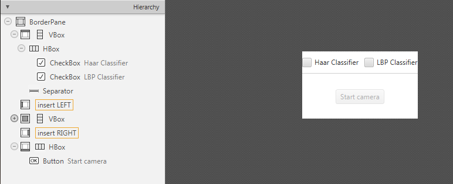
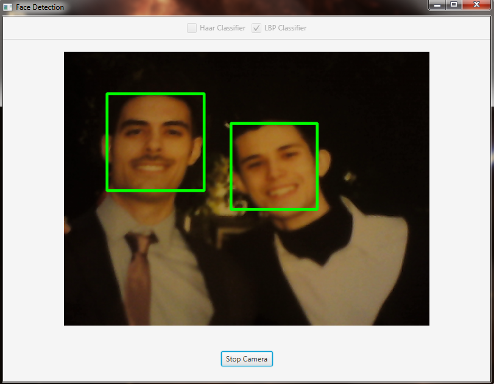

=============================
Face Detection and Tracking
=============================

.. note:: We assume that by now you have already read the previous tutorials. If not, please check previous tutorials at `<http://opencv-java-tutorials.readthedocs.org/en/latest/index.html>`_. You can also find the source code and resources at `<https://github.com/opencv-java/>`_

Goal
----
In this tutorial we are going to use well-known classifiers that have been already trained and distributed by OpenCV in order to detect and track a moving face into a video stream.

Cascade Classifiers
-------------------
The object recognition process (in our case, faces) is usually efficient if it is based on the features take-over which include additional information about the object class to be taken-over. In this tutorial we are going to use the *Haar-like features* and the *Local Binary Patterns* (LBP) in order to encode the contrasts highlighted by the human face and its spatial relations with the other objects present in the picture.
Usually these features are extracted using a *Cascade Classifier* which has to be trained in order to recognize with precision different objects: the faces' classification is going to be much different from the car's classification.

What we will do in this tutorial
--------------------------------
In this guide, we will:
 * Insert a checkbox to select the Haar Classifier, detect and track a face, and draw a green rectangle around the detected face.
 * Insert a checkbox to select the LBP Classifier, detect and track a face, and draw a green rectangle around the detected face.

Getting Started
---------------
Let's create a new JavaFX project. In Scene Builder set the windows element so that we have a Border Pane with:

- on TOP a VBox a HBox and a separator. In the HBox we are goning to need two checkboxes, the first one is to select the Haar Classifier and the second one is to select the LBP Classifier.

	.. code-block:: xml

		<CheckBox fx:id="haarClassifier" onAction="#haarSelected" text="Haar Classifier"/>
		<CheckBox fx:id="lbpClassifier" onAction="#lbpSelected" text="LBP Classifier"/>

- in the CENTRE we are going to put an ImageView for the web cam stream.

	.. code-block:: xml

		<ImageView fx:id="originalFrame" />

- on the BOTTOM we can add the usual button to start/stop the stream

	.. code-block:: xml

		<Button fx:id="cameraButton" alignment="center" text="Start camera" onAction="#startCamera" disable="true" />

The gui will look something like this one:

Loading the Classifiers
-----------------------
First of all we need to add a folder ``resource`` to our project and put the classifiers in it.
In order to use the classifiers we need to load them from the resource folder, so every time that we check one of the two checkboxes we will load the correct classifier.
To do so, let's implement the ``OnAction`` methods we already declared before:

- ``haarSelected``
	inside this method we are going to load the desired Haar Classifier (e.g. ``haarcascade_frontalface_alt.xml``) as follows:

	.. code-block:: java

		this.checkboxSelection("resources/lbpcascades/haarcascade_frontalface_alt.xml");
		...
		private void checkboxSelection(String... classifierPath)
		{
			// load the classifier(s)
			for (String xmlClassifier : classifierPath)
			{
				this.faceCascade.load(xmlClassifier);
			}

			// now the capture can start
			this.cameraButton.setDisable(false);
		}

- ``lbpSelected``
	for the LPB we can use the same method and change the path of the classifier to be loaded:

	.. code-block:: java

		this.checkboxSelection("resources/lbpcascades/lbpcascade_frontalface.xml");

Detection and Tracking
----------------------
Once we've loaded the classifiers we are ready to start the detection; we are going to implement the detection in the ``detectAndDisplay`` method.
First of all we need to convert the frame in grayscale and equalize the histogram to improve the results:

.. code-block:: java

    Imgproc.cvtColor(frame, grayFrame, Imgproc.COLOR_BGR2GRAY);
    Imgproc.equalizeHist(grayFrame, grayFrame);

Then we have to set the minimum size of the face to be detected (this required is need in the actual detection function). Let's set the minimum size as the 20% of the frame height:

.. code-block:: java

    if (this.absoluteFaceSize == 0)
    {
	int height = grayFrame.rows();
	if (Math.round(height * 0.2f) > 0)
	{
		this.absoluteFaceSize = Math.round(height * 0.2f);
	}
    }

Now we can start the detection:

.. code-block:: java

    this.faceCascade.detectMultiScale(grayFrame, faces, 1.1, 2, 0 | Objdetect.CASCADE_SCALE_IMAGE, new Size(this.absoluteFaceSize, this.absoluteFaceSize), new Size());

The ``detectMultiScale`` function detects objects of different sizes in the input image. The detected objects are returned as a list of rectangles.
The parameters are:

 - **image** Matrix of the type CV_8U containing an image where objects are detected.
 - **objects** Vector of rectangles where each rectangle contains the detected object.
 - **scaleFactor** Parameter specifying how much the image size is reduced at each image scale.
 - **minNeighbors** Parameter specifying how many neighbors each candidate rectangle should have to retain it.
 - **flags** Parameter with the same meaning for an old cascade as in the function cvHaarDetectObjects. It is not used for a new cascade.
 - **minSize** Minimum possible object size. Objects smaller than that are ignored.
 - **maxSize** Maximum possible object size. Objects larger than that are ignored.

So the result of the detection is going to be in the **objects** parameter or in our case ``faces``.

Let's put this result in an array of rects and draw them on the frame, by doing so we can display the detected face are:

.. code-block:: java

    Rect[] facesArray = faces.toArray();
    for (int i = 0; i < facesArray.length; i++)
	Imgproc.rectangle(frame, facesArray[i].tl(), facesArray[i].br(), new Scalar(0, 255, 0, 255), 3);

As you can see we selected the color green with a transparent background: ``Scalar(0, 255, 0, 255)``.
``.tl()`` and ``.br()`` stand for *top-left* and *bottom-right* and they represents the two opposite vertexes.
The last parameter just set the thickness of the rectangle's border.

The tracking part can be implemented by calling the ``detectAndDisplay`` method for each frame.

.. image:: _static/08-01.png

The source code of the entire tutorial is available on `GitHub <https://github.com/opencv-java/face-detection>`_.
