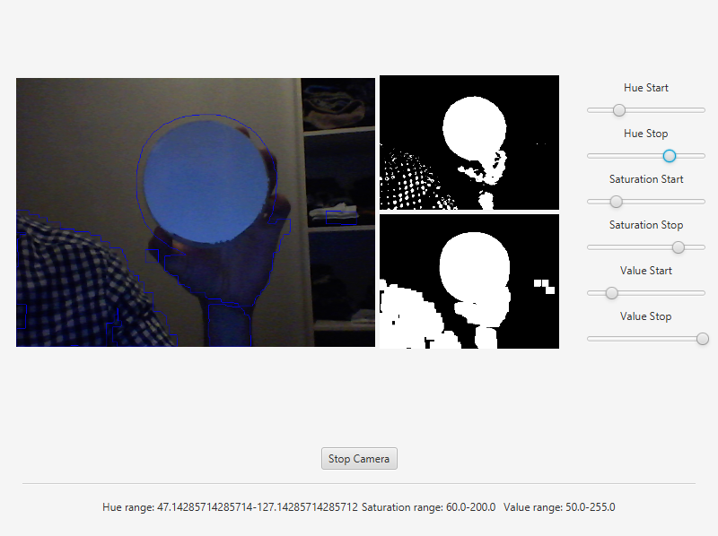
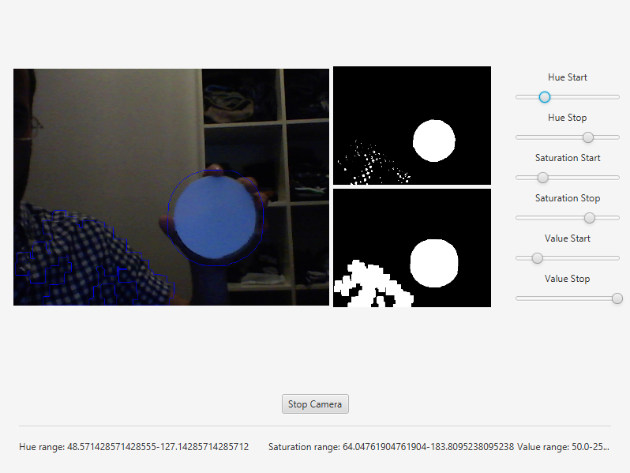

=================
Object Detection
=================

.. note:: We assume that by now you have already read the previous tutorials. If not, please check previous tutorials at `<http://opencv-java-tutorials.readthedocs.org/en/latest/index.html>`_. You can also find the source code and resources at `<https://github.com/opencv-java/>`_

Goal
----
In this tutorial we are going to identify and track one or more tennis balls. It performs the detection of the tennis balls upon a webcam video stream by using the color range of the balls, erosion and dilation, and the findContours method.

Morphological Image Processing
------------------------------
Is a collection of non-linear operations related to the morphology of features in an image. The morphological operations rely only on the relative ordering of pixel values and not on their numerical values.
Some of the fundamental morphological operations are dilation and erosion. Dilation causes objects to dilate or grow in size adding pixels to the boundaries of objects in an image and therefore the holes within different regions become smaller. The dilation allows, for example, to join parts of an object that appear separated.
Erosion causes objects to shrink by stripping away layers of pixels from the boundaries of objects in an image and therefore the holes within different regions become larger. The erosion can be used to remove noise or small errors from the image due to the scanning process.
The opening is a compound operation that consist in an erosion followed by a dilation using the same structuring element for both operations. This operation removes small objects from the foreground of an image and can be used to find things into which a specific structuring element can fit. The opening can open up a gap between objects connected by a thin bridge of pixels. Any regions that have survived the erosion are restored to their original size by the dilation.

What we will do in this tutorial
--------------------------------
In this guide, we will:

 * Insert 3 groups of sliders to control the quantity of HSV (Hue, Saturation and Value) of the image.
 * Capture and process the image from the web cam removing noise in order to facilitate the object recognition.
 * Finally using morphological operator such as erosion and dilation we can identify the objects using the contornous obtained after the image processing.

Getting Started
---------------
Let's create a new JavaFX project. In Scene Builder we set the window elements so that we have a Border Pane with:

- on RIGHT CENTER we can add a VBox. In this one we are going to need 6 sliders, the first couple will control hue, the next one saturation and finally brightness, with these sliders is possible to change the values of the HSV image.

	.. code-block:: xml

               	<Label text="Hue Start" />
		<Slider fx:id="hueStart" min="0" max="180" value="20" blockIncrement="1" />
		<Label text="Hue Stop" />
		<Slider fx:id="hueStop" min="0" max="180" value="50" blockIncrement="1" />
		<Label text="Saturation Start" />
		<Slider fx:id="saturationStart" min="0" max="255" value="60" blockIncrement="1" />
		<Label text="Saturation Stop" />
		<Slider fx:id="saturationStop" min="0" max="255" value="200" blockIncrement="1" />
		<Label text="Value Start" />
		<Slider fx:id="valueStart" min="0" max="255" value="50" blockIncrement="1" />
		<Label text="Value Stop" />
		<Slider fx:id="valueStop" min="0" max="255" value="255" blockIncrement="1" />

- in the CENTER. we are going to put three ImageViews, the first one shows normal image from the web cam stream, the second one will show mask image and the last one will show morph image. The HBox is used to normal image and VBox to put the other ones.

	.. code-block:: xml

		<HBox alignment="CENTER" spacing="5">
			<padding>
				<Insets right="10" left="10" />
			</padding>
			<ImageView fx:id="originalFrame" />
			<VBox alignment="CENTER" spacing="5">
				<ImageView fx:id="maskImage" />
				<ImageView fx:id="morphImage" />
			</VBox>
		</HBox>

- on the BOTTOM we can add the usual button to start/stop the stream and the current values HSV selected with the sliders.

	.. code-block:: xml

		<Button fx:id="cameraButton" alignment="center" text="Start camera" onAction="#startCamera" />
		<Separator />
		<Label fx:id="hsvCurrentValues" />

The gui will look something like this one:

.. image:: _static/09-00.png

Image processing
----------------
In order to use the morphological operators and obtain good results we need to process the image and remove the noise, change the image to HSV allows to get the contours easily.

- ``Remove noise``
	We can remove some noise of the image using the method blur of the Imgproc class and then apply a conversion to
	HSV in order to facilitate the process of object recognition.

	.. code-block:: java

		Mat blurredImage = new Mat();
		Mat hsvImage = new Mat();
		Mat mask = new Mat();
		Mat morphOutput = new Mat();

		// remove some noise
		Imgproc.blur(frame, blurredImage, new Size(7, 7));

		// convert the frame to HSV
		Imgproc.cvtColor(blurredImage, hsvImage, Imgproc.COLOR_BGR2HSV);

- ``Values of HSV image``
	With the sliders we can modify the values of the HSV Image, the image will be updtated in real time,
	that allows to increase or decrease the capactity to recognize object into the image. .

	.. code-block:: java

		// get thresholding values from the UI
		// remember: H ranges 0-180, S and V range 0-255
		Scalar minValues = new Scalar(this.hueStart.getValue(), this.saturationStart.getValue(),
		this.valueStart.getValue());
		Scalar maxValues = new Scalar(this.hueStop.getValue(), this.saturationStop.getValue(),
		this.valueStop.getValue());

		// show the current selected HSV range
		String valuesToPrint = "Hue range: " + minValues.val[0] + "-" + maxValues.val[0]
		+ "\tSaturation range: " + minValues.val[1] + "-" + maxValues.val[1] + "\tValue range: "
		+ minValues.val[2] + "-" + maxValues.val[2];
		this.onFXThread(this.hsvValuesProp, valuesToPrint);

		// threshold HSV image to select tennis balls
		Core.inRange(hsvImage, minValues, maxValues, mask);
		// show the partial output
		this.onFXThread(maskProp, this.mat2Image(mask));

Morphological Operators
-----------------------
First of all we need to define the two matrices of morphological operator dilation and erosion, then with the methods erode and dilate of the class Imgproc we process the image twice in each operation, the result is the matrix morphOutput that will be the partial output.

	.. code-block:: java

	       // morphological operators
	       // dilate with large element, erode with small ones
	        Mat dilateElement = Imgproc.getStructuringElement(Imgproc.MORPH_RECT, new Size(24, 24));
		Mat erodeElement = Imgproc.getStructuringElement(Imgproc.MORPH_RECT, new Size(12, 12));

		Imgproc.erode(mask, morphOutput, erodeElement);
		Imgproc.erode(mask, morphOutput, erodeElement);

		Imgproc.dilate(mask, morphOutput, dilateElement);
		Imgproc.dilate(mask, morphOutput, dilateElement);

		// show the partial output
		this.onFXThread(this.morphProp, this.mat2Image(morphOutput));

Object tracking
------------------
With the partial output obtained before we can use the method findContours of the class Imgpoc to get a matrix with the mapping of the objects recognized, then we draw the contours of these objects.

	.. code-block:: java

		// init
		List<MatOfPoint> contours = new ArrayList<>();
		Mat hierarchy = new Mat();

		// find contours
		Imgproc.findContours(maskedImage, contours, hierarchy, Imgproc.RETR_CCOMP, Imgproc.CHAIN_APPROX_SIMPLE);

		// if any contour exist...
		if (hierarchy.size().height > 0 && hierarchy.size().width > 0)
		{
			// for each contour, display it in blue
			for (int idx = 0; idx >= 0; idx = (int) hierarchy.get(0, idx)[0])
			{
				Imgproc.drawContours(frame, contours, idx, new Scalar(250, 0, 0));
			}
		}

Finally we can get this results:

The source code of the entire tutorial is available on `GitHub <https://github.com/opencv-java/object-detection>`_.
