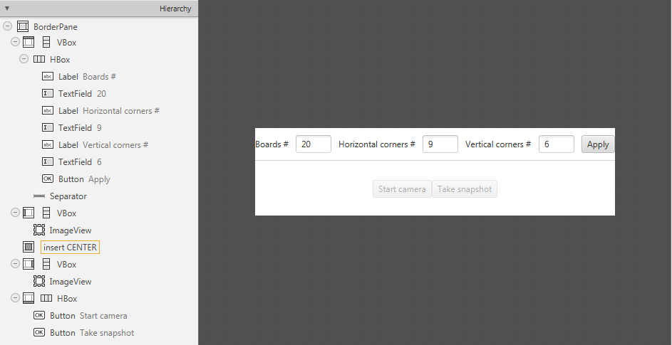

==================
Camera Calibration
==================

.. note:: We assume that by now you have already read the previous tutorials. If not, please check previous tutorials at `<http://opencv-java-tutorials.readthedocs.org/en/latest/index.html>`_. You can also find the source code and resources at `<https://github.com/opencv-java/>`_

.. warning:: This tutorial is *not* updated to OpenCV 3.0.

Goal
----
The goal of this tutorial is to learn how to calibrate a camera given a set of chessboard images.

What is the camera calibration?
-------------------------------
The camera calibration is the process with which we can obtain the camera parameters such as intrinsic and extrinsic parameters, distortions and so on. The calibration of the camera is often necessary when the alignment between the lens and the optic sensors chip is not correct; the effect produced by this wrong alignment is usually more visible in low quality cameras.

Calibration Pattern
-------------------
As we said earlier we are going to need some sort of pattern that the program can recognize in order to make the calibration work. The pattern that we are going to use is a chessboard image.

.. image:: _static/05-00.png

The reason why we use this image is because there are some OpenCV functions that can recognize this pattern and draw a scheme which highlights the intersections between each block.
To make the calibration work you need to print the chessboard image and show it to the cam; it is important to maintain the sheet still, better if stick to a surface.
In order to make a good calibration, we need to have about 20 samples of the pattern taken from different angles and distances.

What we will do in this tutorial
--------------------------------
In this guide, we will:
 * Create some TextEdit field to give some inputs to our program
 * Recognize the pattern using some OpenCV functions
 * Calibrate and show the video stream.

Getting Started
---------------
Create a new JavaFX project (e.g. "CameraCalibration") with the usual OpenCV user library.
Open Scene Builder and add a Border Pane with:

- on **TOP** we need to have the possibility to set the number of samples for the calibration, the number of horizontal corners we have in the test image, the number of vertical corners we have in the test image and a button to update this data. To make things cleaner let's put all these elements inside a HBox.

.. code-block:: xml

    <HBox alignment="CENTER" spacing="10">

Let's also add some labels before each text fields.
Each text field is going to need an id, and let's put a standard value for them already.

.. code-block:: xml

    <Label text="Boards #" />
    <TextField fx:id="numBoards" text="20" maxWidth="50" />
    <Label text="Horizontal corners #" />
    <TextField fx:id="numHorCorners" text="9" maxWidth="50" />
    <Label text="Vertical corners #" />
    <TextField fx:id="numVertCorners" text="6" maxWidth="50" />

For the button instead, set the id and a method for the onAction field:

.. code-block:: xml

    <Button fx:id="applyButton" alignment="center" text="Apply" onAction="#updateSettings" />

- on the **LEFT** add an ImageView inside a VBox for the normal cam stream; set an id for it.

.. code-block:: xml

    <ImageView fx:id="originalFrame" />

- on the **RIGHT** add an ImageView inside a VBox for the calibrated cam stream; set an id for it.

.. code-block:: xml

    <ImageView fx:id="originalFrame" />

- in the **BOTTOM** add a start/stop cam stream button and a snapshot button inside a HBox; set an id and a action method for each one.

.. code-block:: xml

    <Button fx:id="cameraButton" alignment="center" text="Start camera" onAction="#startCamera" disable="true" />
    <Button fx:id="snapshotButton" alignment="center" text="Take snapshot" onAction="#takeSnapshot" disable="true" />

Your GUI will look something like this:

Pattern Recognition
-------------------
The calibration process consists on showing to the cam the chessboard pattern from different angles, depth and points of view. For each recognized pattern we need to track:

 - some reference system's 3D point where the chessboard is located (let's assume that the Z axe is always 0):

	.. code-block:: java

		for (int j = 0; j < numSquares; j++)
		   obj.push_back(new MatOfPoint3f(new Point3(j / this.numCornersHor, j % this.numCornersVer, 0.0f)));

 - the image's 2D points (operation made by OpenCV with findChessboardCorners):

	.. code-block:: java

		boolean found = Calib3d.findChessboardCorners(grayImage, boardSize, imageCorners, Calib3d.CALIB_CB_ADAPTIVE_THRESH + Calib3d.CALIB_CB_NORMALIZE_IMAGE + Calib3d.CALIB_CB_FAST_CHECK);

The ``findChessboardCorners`` function attempts to determine whether the input image is a view of the chessboard pattern and locate the internal chessboard corners.
Its parameters are:

 - **image** Source chessboard view. It must be an 8-bit grayscale or color image.
 - **patternSize** Number of inner corners per a chessboard row and column
 - **corners** Output array of detected corners.
 - **flags** Various operation flags that can be zero or a combination of the following values:
	- ``CV_CALIB_CB_ADAPTIVE_THRESH`` Use adaptive thresholding to convert the image to black and white, rather than a fixed threshold level (computed from the average image brightness).
	- ``CV_CALIB_CB_NORMALIZE_IMAGE`` Normalize the image gamma with "equalizeHist" before applying fixed or adaptive thresholding.
	- ``CV_CALIB_CB_FILTER_QUADS`` Use additional criteria (like contour area, perimeter, square-like shape) to filter out false quads extracted at the contour retrieval stage.
	- ``CALIB_CB_FAST_CHECK`` Run a fast check on the image that looks for chessboard corners, and shortcut the call if none is found. This can drastically speed up the call in the degenerate condition when no chessboard is observed.

.. warning:: Before doing the ``findChessboardCorners`` convert the image to grayscale and save the board size into a Size variable:

	.. code-block:: java

	    Imgproc.cvtColor(frame, grayImage, Imgproc.COLOR_BGR2GRAY);
	    Size boardSize = new Size(this.numCornersHor, this.numCornersVer);

If the recognition went well ``found`` should be ``true``.

For square images the positions of the corners are only approximate. We may improve this by calling the ``cornerSubPix`` function. It will produce better calibration result.

.. code-block:: java

    TermCriteria term = new TermCriteria(TermCriteria.EPS | TermCriteria.MAX_ITER, 30, 0.1);
    Imgproc.cornerSubPix(grayImage, imageCorners, new Size(11, 11), new Size(-1, -1), term);

We can now highlight the found points on stream:

.. code-block:: java

    Calib3d.drawChessboardCorners(frame, boardSize, imageCorners, found);

The function draws individual chessboard corners detected either as red circles if the board was not found, or as colored corners connected with lines if the board was found.

Its parameters are:

 - **image** Destination image. It must be an 8-bit color image.
 - **patternSize** Number of inner corners per a chessboard row and column.
 - **corners** Array of detected corners, the output of findChessboardCorners.
 - **patternWasFound** Parameter indicating whether the complete board was found or not. The return value of ``findChessboardCorners`` should be passed here.

Now we can activate the Snapshot button to save the data.

.. code-block:: java

    this.snapshotButton.setDisable(false);

.. image:: _static/05-01.png

.. image:: _static/05-02.png

We should take the set number of "snapshots" from different angles and depth, in order to make the calibration.

.. note:: We don't actually save the image but just the data we need.

Saving Data
-----------
By clicking on the snapshot button we call the ``takeSnapshot`` method. Here we need to save the data (2D and 3D points)  if we did not make enough sample:

.. code-block:: java

    this.imagePoints.add(imageCorners);
    this.objectPoints.add(obj);
    this.successes++;

Otherwise we can calibrate the camera.

Camera Calibration
------------------
For the camera calibration we should create initiate some needed variable and then call the actual calibration function:

.. code-block:: java

    List<Mat> rvecs = new ArrayList<>();
    List<Mat> tvecs = new ArrayList<>();
    intrinsic.put(0, 0, 1);
    intrinsic.put(1, 1, 1);

    Calib3d.calibrateCamera(objectPoints, imagePoints, savedImage.size(), intrinsic, distCoeffs, rvecs, tvecs);

The ``calibrateCamera`` function estimates the intrinsic camera parameters and extrinsic parameters for each of the views. The algorithm is based on [Zhang2000] and [BouguetMCT]. The coordinates of 3D object points and their corresponding 2D projections in each view must be specified.
Its parameters are:

 - **objectPoints** In the new interface it is a vector of vectors of calibration pattern points in the calibration pattern coordinate space. The outer vector contains as many elements as the number of the pattern views. The points are 3D, but since they are in a pattern coordinate system, then, if the rig is planar, it may make sense to put the model to a XY coordinate plane so that Z-coordinate of each input object point is 0.
 - **imagePoints** It is a vector of vectors of the projections of calibration pattern points.
 - **imageSize** Size of the image used only to initialize the intrinsic camera matrix.
 - **cameraMatrix** Output 3x3 floating-point camera matrix *A = |fx 0 cx| |0 fy cy| |0 0 1|*. If ``CV_CALIB_USE_INTRINSIC_GUESS`` and/or ``CV_CALIB_FIX_ASPECT_RATIO`` are specified, some or all of *fx*, *fy*, *cx*, *cy* must be initialized before calling the function.
 - **distCoeffs** Output vector of distortion coefficients of 4, 5, or 8 elements.
 - **rvecs** Output vector of rotation vectors estimated for each pattern view. That is, each k-th rotation vector together with the corresponding k-th translation vector.
 - **tvecs** Output vector of translation vectors estimated for each pattern view.

We ran calibration and got camera's matrix with the distortion coefficients we may want to correct the image using ``undistort`` function:

.. code-block:: java

    if (this.isCalibrated)
    {
	// prepare the undistored image
	Mat undistored = new Mat();
	Imgproc.undistort(frame, undistored, intrinsic, distCoeffs);
	undistoredImage = mat2Image(undistored);
    }

The ``undistort`` function transforms an image to compensate radial and tangential lens distortion.

The source code of the entire tutorial is available on `GitHub <https://github.com/opencv-java/camera-calibration>`_.
